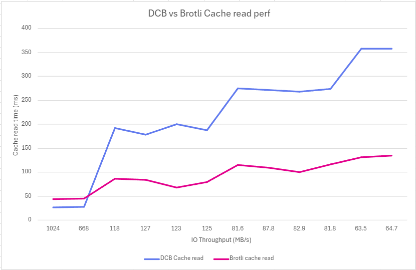

# CDT Cache Performance Sweep Test

## Goal

This test suite measures and compares **DCB (Dictionary Compressed Brotli) cache read performance** versus **standard Brotli cache read performance** across varying I/O latency conditions.

The primary objective is to understand how I/O latency affects the relative performance of CDT (Compression Dictionary Transport), since DCB that is stored uncompressed on disk cache requires an additional disk read to fetch the dictionary from cache before serving it.

## Overview

The sweep test is an automated performance benchmarking tool that:

1. **Creates a throttled I/O path** using Linux device-mapper to simulate various disk latency conditions
2. **Configures Chrome browser** to use this throttled path for its HTTP cache storage
3. **Runs CDT performance tests** at different I/O delay levels (0-50ms)
4. **Captures and analyzes results** to understand the impact of I/O latency on CDT performance

## Example Results
(test on Windows 11 WSL 2 Ubuntu env)
```bash
$ ./run-perf-sweep.sh 0 10 1


CDT Performance Sweep
==========================================
Start Delay: 0ms
End Delay: 10ms
Increment: 1ms
Results file: cdt-perf-results-20251130-105449.csv
==========================================


Running control test (no throttling)...
[INFO] Running CDT test without I/O throttling...
[INFO] Control results: DCB=26.50ms, Brotli=43.60ms
[INFO] Test 1 of 11

Testing with I/O delay: 0ms
==========================================
[INFO] Setting up throttled I/O with 0ms delay...
[INFO] Measured throughput: 668 MB/s
[INFO] Running CDT performance test...
[INFO] Results: DCB=28.50ms, Brotli=45.20ms, Gap=-16.70ms
[INFO] Test 2 of 11

Testing with I/O delay: 1ms
==========================================
[INFO] Setting up throttled I/O with 1ms delay...
[INFO] Measured throughput: 118 MB/s
[INFO] Running CDT performance test...
[INFO] Results: DCB=192.40ms, Brotli=86.30ms, Gap=106.10ms
[INFO] Test 3 of 11
...
```

## Report

```
================================================================================
                    CDT CACHE READ PERFORMANCE SWEEP REPORT
================================================================================

Test Date: Sun Nov 30 11:41:52 IST 2025
Delay Range: 0ms to 10ms (increment: 1ms)

--------------------------------------------------------------------------------
                              RESULTS TABLE
--------------------------------------------------------------------------------

IO Delay        Throughput      DCB Read        Brotli Read     Gap       
(per read)                      Time            Time                      
--------------------------------------------------------------------------------
0 (control) ms  ~1 GB/s         26.50 ms        43.60 ms        -17.10 ms 
0 ms            668 MB/s        28.50 ms        45.20 ms        -16.70 ms 
1 ms            118 MB/s        192.40 ms       86.30 ms        106.10 ms 
2 ms            127 MB/s        178.40 ms       84.60 ms        93.80 ms  
3 ms            123 MB/s        200.00 ms       67.80 ms        132.20 ms 
4 ms            125 MB/s        188.00 ms       79.70 ms        108.30 ms 
5 ms            81.6 MB/s       275.60 ms       115.10 ms       160.50 ms 
6 ms            87.8 MB/s       272.20 ms       110.00 ms       162.20 ms 
7 ms            82.9 MB/s       267.80 ms       101.00 ms       166.80 ms 
8 ms            81.8 MB/s       274.40 ms       116.70 ms       157.70 ms 
9 ms            63.5 MB/s       357.80 ms       131.50 ms       226.30 ms 
10 ms           64.7 MB/s       357.80 ms       135.50 ms       222.30 ms 

```



# Analysis
As throughput goes down, the gap between brotli cache and dcb cache typically increases because DCB
requires additional I/O to read the dictionary from disk cache as it is not compressed.

This may justify a change in the user agent to compress the DCB content before saving it to cache 
and decompress when reading in order to avoid a regression on subsequent cache read of the same resource.

## How It Works

### Architecture

```
┌─────────────────────────────────────────────────────────────────────┐
│                         Test Runner                                 │
│                    (run-perf-sweep.sh)                              │
└─────────────────────────────────────────────────────────────────────┘
                                │
                                ▼
┌─────────────────────────────────────────────────────────────────────┐
│                    Throttled I/O Setup                              │
│                 (setup-throttled-io.sh)                             │
│  ┌───────────┐    ┌──────────────┐    ┌─────────────────────────┐   │
│  │ Loop Dev  │ -> │ dm-delay     │ -> │ ~/throttled_io mount    │   │
│  │ (/tmp/    │    │ (configurable│    │ (Chrome cache dir)      │   │
│  │  .img)    │    │  delay)      │    │                         │   │
│  └───────────┘    └──────────────┘    └─────────────────────────┘   |
└─────────────────────────────────────────────────────────────────────┘
                                │
                                ▼
┌─────────────────────────────────────────────────────────────────────┐
│                    CDT Performance Test                             │
│                  (cdt-test.spec.ts)                                 │
│  - Launches Chrome with --disk-cache-dir=~/throttled_io             │
│  - Loads base file (brotli) and diff file (DCB)                     │
│  - Measures cache read timing for both                              │
└─────────────────────────────────────────────────────────────────────┘
```

### Throttled I/O Setup

The `setup-throttled-io.sh` script creates a controlled I/O environment:

1. **Creates a loop device** backed by a 100MB file (`/tmp/throttled.img`)
2. **Formats with ext4 filesystem**
3. **Uses device-mapper's delay target** to add configurable latency to all I/O operations
4. **Mounts at `~/throttled_io`** for Chrome to use as its cache directory

This allows precise control over I/O latency without affecting the rest of the system.

### Test Execution

For each I/O delay level, the test:

1. Sets up throttled I/O with the specified delay
2. Clears the browser cache
3. Loads the base file (populates cache with brotli-compressed content)
4. Loads the diff file (populates cache with DCB content, uses base as dictionary)
5. **Flushes filesystem cache** (ensures cold reads from disk)
6. Measures **DCB cache read time** (requires reading both dictionary and diff)
7. Measures **Brotli cache read time** (single file read)
8. Records the timing gap

## Usage

### Running the Sweep Test

```bash
# Run with default parameters (1ms to 50ms, 10ms increments)
./run-perf-sweep.sh

# Custom range: 5ms to 100ms with 5ms increments
./run-perf-sweep.sh 5 100 5

# Single delay point at 20ms
./run-perf-sweep.sh 20 20 1
```

### Parameters

| Parameter | Default | Description |
|-----------|---------|-------------|
| `start_delay` | 1 | Starting I/O delay in milliseconds |
| `end_delay` | 50 | Ending I/O delay in milliseconds |
| `increment` | 10 | Step size between delay values |

### Prerequisites

- Linux with device-mapper support (`dm-delay` target)
- `sudo` privileges (required for dmsetup and cache flushing)
- Chrome/Chromium browser installed at `/usr/bin/google-chrome`
- Node.js 18+ and npm

## Output Files

The sweep test generates two output files:

### CSV Results (`cdt-perf-results-YYYYMMDD-HHMMSS.csv`)

```csv
Delay_ms,Throughput,DCB_Read_ms,Brotli_Read_ms,Gap_ms
0 (control),~1 GB/s,6.30,8.00,-1.70
0,665 MB/s,8.30,7.50,.80
10,63.0 MB/s,70.00,48.70,21.30
...
```

### Text Report (`cdt-perf-report-YYYYMMDD-HHMMSS.txt`)

Detailed human-readable report including:
- Test parameters and timestamp
- Results table with all measurements
- Analysis explaining the metrics

## Understanding the Results

### Metrics Explained

| Metric | Description |
|--------|-------------|
| **IO Delay** | Configured delay per I/O operation (milliseconds) |
| **Throughput** | Measured disk read speed with throttling applied |
| **DCB Read Time** | Time to read diff file from cache (includes dictionary read) |
| **Brotli Read Time** | Time to read base file from cache (single file read) |
| **Gap** | DCB Read Time - Brotli Read Time |

### Interpreting the Gap

- **Positive gap**: DCB is slower than Brotli (expected at higher I/O latencies)
- **Negative gap**: DCB is faster than Brotli (possible at very low latencies due to smaller transfer size)
- **Increasing gap with delay**: Shows the I/O cost of reading the dictionary

### Expected Behavior

As I/O delay increases:
1. **Both read times increase** (more time spent waiting for I/O)
2. **The gap typically increases** because DCB requires an additional I/O operation to read the dictionary from cache
3. **At very high latencies**, the dictionary read overhead becomes significant

## Technical Details

### CDT (Compression Dictionary Transport)

CDT allows browsers to use a previously cached resource as a compression dictionary for new resources. This enables much better compression ratios for resources that share common content (e.g., updated JavaScript bundles).

- **DCB (Dictionary Compressed Brotli)**: Uses a cached "base" file as the dictionary
- **Standard Brotli**: Self-contained compression without external dictionary

### Filesystem Cache Flushing

The test uses `echo 3 > /proc/sys/vm/drop_caches` to ensure cold cache reads. Without this, the kernel's page cache would mask the actual disk I/O latency, invalidating the measurements.

## Troubleshooting

### Common Issues

| Issue | Solution |
|-------|----------|
| Permission denied | Ensure you have sudo privileges |
| Chrome not found | Install Chrome at `/usr/bin/google-chrome` |
| dm-delay not available | Load the kernel module: `modprobe dm-delay` |
| Cache not being used | Check that `CDT_CACHE_DIR` environment variable is set correctly |

### Verifying Setup

```bash
# Check if device-mapper is loaded
lsmod | grep dm_delay

# Verify throttled mount
mount | grep throttled_io
```
